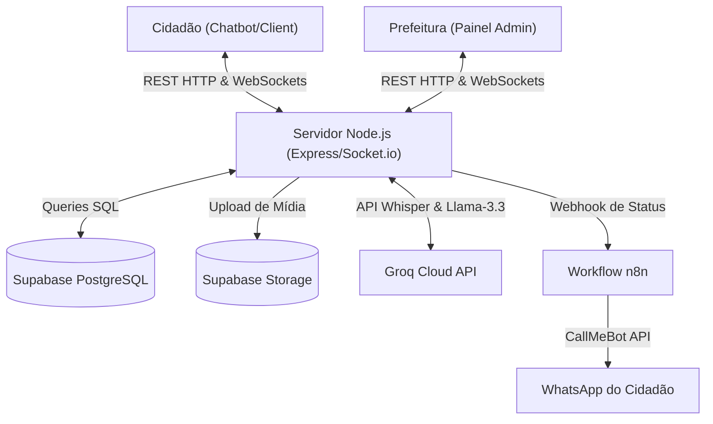

# Documentação Técnica: Plataforma de Zeladoria Urbana (Diadema)

## 1. Visão Geral e Objetivo

O objetivo deste projeto foi desenvolver uma plataforma web de zeladoria urbana onde os cidadãos de Diadema possam registrar problemas da cidade (buracos, falta de luz, lixo acumulado, vazamentos, etc.) através de um chatbot inteligente. O sistema atua em duas frentes:
1. **Para o Cidadão:** Uma interface de chat acessível, direta e sem formulários burocráticos.
2. **Para a Prefeitura:** Um painel administrativo em tempo real para visualização, análise de urgência e atualização do status dos chamados.

Todo o projeto foi construído **exclusivamente com ferramentas e camadas gratuitas (free-tier)**, cumprindo com rigor as exigências propostas.

---

## 2. O Desafio Proposto

O desenvolvimento seguiu os requisitos de um desafio técnico para uma vaga de estágio na Prefeitura de Diadema, cujos critérios incluíam:
- **Landing Page:** Página simples de apresentação com acesso ao chatbot.
- **Chatbot:** Coletar nome, telefone, descrição, imagem, manter histórico e gerar protocolo.
- **Banco de Dados:** Salvar usuário, telefone, descrição, imagem, status e data de criação.
- **Painel Administrativo:** Tela para visualizar chamados, ver imagens e alterar status (Aberto, Em andamento, Resolvido).
- **Notificação:** Alertar o usuário via WhatsApp ou E-mail após mudança de status.
- **Tecnologias Obrigatórias:** Apenas ferramentas gratuitas. (Sugestões: Next.js, React, Node.js, Express, Supabase, Groq).
- **Diferenciais Esperados e Implementados:** Streaming de resposta, responsividade, dashboard, geolocalização, classificação por IA, WebSockets e automação com n8n.

---

## 3. Processo de Desenvolvimento e Lógica Utilizada

Durante o desenvolvimento, o foco principal foi construir uma arquitetura limpa, separando bem as responsabilidades do frontend e do backend, e garantindo que as lógicas escolhidas resolvessem problemas reais da infraestrutura pública. 

**Nota sobre o uso de IA no código:** Durante a construção, ferramentas de IA (como o Gemini) foram utilizadas pontualmente como apoio ao desenvolvimento, ajudando na geração de estruturas base (boilerplate), revisão de sintaxe e resolução de pequenos bugs. No entanto, toda a arquitetura, lógica de negócios, integrações de APIs complexas e decisões estruturais foram elaboradas manualmente com base em extensa pesquisa e leitura da documentação oficial de cada tecnologia.

---

## 4. Funcionalidades Principais: Como Funcionam e Por Que Foram Adicionadas

### 4.1. Restrição Geográfica Rigorosa (Exclusivo Diadema)
- **Por que foi adicionado?** Um sistema de zeladoria municipal só tem utilidade se os chamados pertencerem ao município em questão. Se um cidadão tentar relatar um problema em outra cidade (ex: São Bernardo do Campo, São Paulo, etc.), a prefeitura de Diadema não terá jurisdição nem equipe para atuar.
- **Como funciona:** O sistema possui uma **dupla camada de validação geográfica** para garantir que chamados fora do município sejam barrados imediatamente:
  1. **Camada de Geolocalização e Mapa (GPS/Nominatim/Photon):** Quando o usuário busca ou envia um ponto geográfico, o frontend cruza e exibe apenas locais que respondam a coordenadas geográficas próximas ao município. Além disso, as opções rápidas sugerem marcos oficiais de Diadema.
  2. **Camada de Inteligência Artificial (Groq/Llama-3.3):** A IA atua como um validador rígido do contexto em linguagem natural. Nas instruções do sistema do modelo (`REGRA 1 - LOCALIZAÇÃO`), se o local mencionado ou enviado pelo cidadão for identificado como inexistente em Diadema ou pertencente a outra cidade, a IA interrompe o fluxo de criação. O backend recebe a resposta da IA com a propriedade `criar_chamado: false`, o bot responde educadamente que o serviço é exclusivo de Diadema e o registro do chamado no banco de dados (Supabase) é completamente impedido.

### 4.2. Painel Administrativo e Escalonamento de Urgência
- **Por que foi adicionado?** O administrador precisa visualizar o que é mais crítico de relance para despachar equipes.
- **Como funciona:** O painel lista todos os chamados. Conforme a IA identifica duplicidades (vários relatos do mesmo problema), a prioridade do chamado sobe dinamicamente. Um buraco reportado 1 vez pode nascer com prioridade "Baixa", mas se reportado múltiplas vezes em um curto período, o sistema automaticamente eleva para **"Urgente"** e destaca visualmente a ocorrência no topo do dashboard. O painel também permite alteração do fluxo de trabalho (Aberto, Em andamento, Resolvido) e visualização de mapas.

### 4.3. Notificação via WhatsApp (n8n + CallMeBot)
- **Por que foi adicionado?** O cidadão precisa receber um feedback real do seu problema para criar confiança na gestão pública.
- **Como funciona e Limitação Atual:** Quando o administrador altera ou resolve um chamado, o backend dispara um webhook HTTP para o **n8n**. O n8n recebe os dados, formata a mensagem e a envia via WhatsApp para o telefone do cidadão. 
  - *Detalhe Técnico Importante:* Como a exigência era usar apenas ferramentas gratuitas, foi adotada a API do **CallMeBot**. Essa camada grátis tem uma limitação de segurança: só permite enviar mensagens para o próprio número do desenvolvedor (meu WhatsApp pessoal) ou números previamente autorizados por um PIN. Em um cenário de produção com o orçamento da prefeitura, bastaria trocar o *node* do CallMeBot no n8n pelo nó oficial do WhatsApp Business API para que qualquer número do Brasil recebesse as notificações instantaneamente.

### 4.4. Reconhecimento de Áudio (Speech-to-Text)
- **Por que foi adicionado?** Situações de zeladoria muitas vezes ocorrem na rua, no trânsito ou em emergências (ex: árvore caída em via pública) onde o cidadão não tem tempo, estabilidade ou segurança para digitar. Além disso, garante inclusão digital para pessoas com dificuldade de leitura/escrita.
- **Como funciona:** O áudio é gravado na interface e enviado ao backend, que utiliza o modelo de inteligência artificial Whisper (via Groq API) para transcrever a voz em texto de forma instantânea, injetando o relato no chat.

### 4.5. Triagem Inteligente
- **Por que foi adicionado?** Para evitar a duplicação de trabalho da equipe da prefeitura. Se 15 pessoas relatam o mesmo poste apagado na mesma rua, a equipe deve ver 1 problema prioritário na tela, e não 15 chamados soltos.
- **Como funciona:** A IA extrai o contexto e a localização em linguagem natural. Antes de inserir no banco de dados, o sistema cruza as coordenadas e o tipo de problema. Caso constate que é um problema já relatado, ele unifica as informações no banco.

### 4.6. Comunicação em Tempo Real (WebSockets)
- **Por que foi adicionado?** A prefeitura não pode perder tempo recarregando a página. Se um chamado entra, a tela precisa atualizar na hora.
- **Como funciona:** Integrado com `socket.io`. Assim que o chatbot salva um ticket novo ou uma atualização de urgência no Supabase, um broadcast é emitido para todos os administradores logados, atualizando a fila na mesma fração de segundo.

### 4.7. Resumos Gerados por IA (Consolidação)
- **Por que foi adicionado?** Quando um chamado se torna urgente e possui dezenas de relatos (ex: 20 moradores reclamando de uma mesma rua sem luz), o gestor público não tem tempo de ler os 20 relatos individuais para entender a situação completa.
- **Como funciona:** A IA entra em ação novamente no painel administrativo. Ela analisa todos os relatos vinculados àquele problema e gera um resumo único, direto e consolidado, acelerando o processo de despacho da equipe de reparo.

### 4.8. Responsividade e Design Mobile-First
- **Por que foi adicionado?** A imensa maioria dos cidadãos fará o registro de problemas através do smartphone, muitas vezes na própria rua.
- **Como funciona:** A interface da Landing Page e do Chatbot foi inteiramente construída com a abordagem *Mobile-First*, garantindo que a usabilidade seja perfeita e fluida em telas pequenas, com botões bem dimensionados para o toque (touch) e telas que se adaptam naturalmente até monitores desktop.

### 4.9. Exportação de Relatórios Administrativos (Excel)
- **Por que foi adicionado?** A gestão pública exige a geração de relatórios de métricas para transparência, fechamento de mês e auditoria de chamados resolvidos.
- **Como funciona:** O painel administrativo conta com uma funcionalidade de exportação de dados. O sistema compila os chamados e gera um arquivo `.xlsx` estruturado e formatado automaticamente para download instantâneo da equipe da prefeitura.

### 4.10. Feedback Visual e Micro-interações
- **Por que foi adicionado?** Para que o cidadão perceba que o sistema está respondendo aos seus comandos, evitando cliques duplos e ansiedade (ex: não saber se o bot travou ou está "pensando").
- **Como funciona:** Utilizando animações fluídas (como *Framer Motion*), foram criados os estados de "digitando...", transições suaves para mensagens que chegam e rolagem automática no chat. Isso torna a conversa mais orgânica, similar aos aplicativos de mensagem reais que o cidadão já está acostumado a usar.

### 4.11. Identidade Visual Municipal e Modos Claro/Escuro
- **Por que foi adicionado?** Para estreitar a conexão do cidadão com os canais municipais oficiais, o sistema adota as cores da bandeira de Diadema e oferece suporte a Modo Claro e Modo Escuro visando **garantir maior acessibilidade** para cidadãos com diferentes necessidades visuais ou que acessem a plataforma em variadas condições de iluminação.
- **Como funciona:** 
  - **Paleta de Cores e Favicon:** A interface foi modelada com a paleta oficial da bandeira de Diadema (tons de azul-escuro, azul-celeste e branco). A bandeira de Diadema foi incorporada em locais estratégicos das páginas, no avatar do chatbot e no próprio favicon da aplicação.
  - **Suporte a Modo Claro e Escuro:** A plataforma possui um sistema de troca de temas que armazena a preferência do usuário no `localStorage` e a inicializa instantaneamente no servidor para evitar oscilações de tela (*flickering*).
  - **Harmonização Estética:** Todos os ícones funcionais do sistema, como o alternador de temas (sol/lua) e botões, adaptam-se dinamicamente ao tema selecionado (por exemplo, o ícone de sol assume a cor branca no tema escuro, e a lua adapta-se ao tema claro), combinando com as variáveis CSS de cor de primeiro plano do sistema (`var(--color-foreground)`).

### 4.12. Histórico de Chamados do Cidadão (Meus Chamados)
- **Por que foi adicionado?** Para permitir que o cidadão acompanhe o andamento de seus relatos anteriores sem a necessidade de ligar para a prefeitura ou guardar papéis físicos.
- **Como funciona:** O chatbot possui um painel lateral dinâmico de histórico ("Meus Chamados"). Ao ser aberto, ele faz uma consulta ao banco de dados utilizando o número de telefone do cidadão, listando em tempo real todos os chamados abertos por ele, seus respectivos protocolos, resumos e status de resolução atualizados.

### 4.13. Envio de Evidências Visuais (Fotos de Ocorrências)
- **Por que foi adicionado?** Uma imagem ajuda a equipe da prefeitura a avaliar a gravidade do problema (por exemplo, a profundidade de um buraco ou a extensão de um vazamento de água) antes de enviar a equipe ao local.
- **Como funciona:** O cidadão pode anexar uma foto diretamente pelo chat. A foto é convertida para base64 e enviada via WebSockets ao servidor, que faz o upload seguro para o Supabase Storage Bucket e salva a URL pública no registro do chamado. Os administradores podem visualizar a foto em alta resolução diretamente pelo modal de detalhes do painel.

### 4.14. Autenticação e Proteção do Painel Administrativo
- **Por que foi adicionado?** A gestão de status de obras e a visualização de dados de cidadãos são restritas a funcionários públicos autorizados da prefeitura.
- **Como funciona:** O painel administrativo (/admin) possui uma tela de login com animação inteligente de erro (efeito shake). O acesso só é concedido mediante a inserção da credencial administrativa correta, protegendo as rotas de triagem e visualização do dashboard.

---

## 5. Arquitetura do Sistema e Tecnologias

O projeto utiliza a arquitetura de **Monorepo**, estruturado de forma desacoplada para otimizar os fluxos de trabalho e deploys independentes. A comunicação entre a interface (cliente) e o servidor baseia-se em uma **API REST tradicional** combinada com **canais de comunicação persistentes via WebSockets**.



### 5.1. Frontend (Next.js, React, Tailwind CSS)
* **Estrutura de Rotas (Next.js App Router):** Adota a estrutura de rotas baseada em arquivos (`app/page.tsx` para o chat/landing page e `app/admin/page.tsx` para o painel administrativo).
* **Gerenciamento de Estado Reativo:** Utiliza hooks nativos do React (`useState`, `useEffect`, `useRef`) para gerenciar as mensagens do chatbot, preenchimento de campos de formulário, e rolagem automática suave do chat.
* **Componentização e Reutilização:** Componentes modulares reutilizáveis em `src/components/ui` (Button, Input) e componentes específicos de domínio em `src/components/Admin` e `src/components/Chatbot`.
* **Abstração de Efeitos (Custom Hooks):** Isolamento de lógicas de infraestrutura:
  * `useSocket`: Gerencia a conexão com o servidor WebSocket, ouvindo e emitindo eventos de chamados e conversas.
  * `useTickets`: Gerencia a comunicação HTTP REST com o backend para buscar e manipular chamados da prefeitura e do cidadão.
* **Design de Tema com Tailwind CSS v4:** Definição de cores semânticas usando variáveis CSS nativas que mudam dinamicamente no atributo `data-theme="light"` ou `data-theme="dark"` da tag `<html>`, garantindo acessibilidade visual sob diferentes condições de luz.
* **Resolução de Hidratação:** Aplicação de `suppressHydrationWarning` no Root Layout para suportar injeções de segurança do cliente (como antivírus Kaspersky) e scripts de definição de tema que modificam a árvore DOM antes da hidratação do React.

### 5.2. Backend (Node.js, Express, Socket.io)
* **Servidor HTTP REST:** Fornece rotas estruturadas com controllers separados para mensagens (`chatController`) e chamados (`ticketController`).
* **WebSockets Bidirecionais (Socket.io):** Estabelece comunicação bidirecional com canais dedicados para o chatbot (eventos `chat_message` e `audio_message`) e sincronização em tempo real do painel administrativo (broadcasting de eventos `new_ticket`, `update_ticket` e `delete_ticket`).
* **Buffer de Alta Capacidade para Mídias:** Configuração de `maxHttpBufferSize: 1e8` (100MB) para receber imagens de alta resolução convertidas em Base64 a partir do celular sem rejeição ou limite de buffer.
* **Segurança das Variáveis de Ambiente:** Utilização do pacote `dotenv` para centralizar segredos do Supabase, chaves de API do Groq e webhooks do n8n de forma protegida e inacessível no cliente.

### 5.3. Banco de Dados e Storage (Supabase)
* **Persistência Relacional (PostgreSQL):** Banco relacional hospedado na nuvem do Supabase, mapeando de forma segura as tabelas de `tickets` (chamados), `reports` (relatos individuais unificados por IA) e dados de usuários.
* **Armazenamento de Objetos (Supabase Storage):** Bucket público de storage dedicado à persistência física das imagens de ocorrências enviadas pelos cidadãos, salvando o caminho/URL público correspondente na linha do ticket no banco.

### 5.4. Inteligência Artificial (Groq API)
* **Motor de Triagem Inteligente (Llama-3.3-70b):** IA com baixa latência configurada para interpretar linguagem natural, validar geograficamente o relato (garantindo exclusividade territorial de Diadema), detectar duplicidades de problemas na mesma área e consolidar múltiplos relatos de moradores em resumos únicos e executivos.
* **Transcrição de Voz (Whisper-large-v3):** Transcreve áudios gravados pelo cidadão no formato `.webm` base64 de volta para texto em português de forma instantânea para inclusão no histórico de mensagens.

### 5.5. Integração e Notificações (n8n, CallMeBot)
* **Integração Baseada em Gatilhos:** Envio assíncrono de Webhooks HTTP contendo detalhes de status e dados do cidadão sempre que um administrador altera um chamado (ex: para "Resolvido").
* **Serviço de WhatsApp:** O webhook do n8n recebe a alteração e despacha o alerta utilizando a API do CallMeBot para enviar a notificação instantaneamente no celular do morador que abriu o chamado.

### 5.6. Detalhamento das Rotas da API (Endpoints REST)
O backend do sistema expõe quatro endpoints HTTP REST para consulta e manipulação dos dados dos chamados:

1. **`GET /api/tickets`**
   - **Descrição:** Retorna a listagem completa de todos os chamados cadastrados no banco de dados.
   - **Finalidade:** Utilizada pelo painel do administrador para renderizar a fila de ocorrências.
   - **Formato de Resposta:** Array de objetos JSON contendo os dados de cada chamado (id, protocol, user_name, user_phone, description, status, priority, report_count, created_at).

2. **`GET /api/tickets/user/:phone`**
   - **Descrição:** Retorna todos os chamados associados a um telefone específico do cidadão.
   - **Finalidade:** Utilizada pelo painel "Meus Chamados" no chatbot do cidadão para renderizar o seu histórico local de ocorrências.
   - **Parâmetro:** `:phone` (string contendo o número formatado ou apenas dígitos).
   - **Formato de Resposta:** Array de objetos JSON correspondentes aos chamados do usuário.

3. **`PUT /api/tickets/:id/status`**
   - **Descrição:** Altera a etapa de resolução de um chamado.
   - **Finalidade:** Permite ao administrador marcar um chamado como "Aberto", "Em andamento" ou "Resolvido".
   - **Payload do Request:** `{ "status": "Aberto" | "Em andamento" | "Resolvido" }`
   - **Ações secundárias:** Caso o status seja alterado, o backend dispara um webhook HTTP para o n8n para notificar o cidadão via WhatsApp.

4. **`PUT /api/tickets/:id/priority`**
   - **Descrição:** Atualiza a prioridade/urgência do chamado.
   - **Finalidade:** Permite ao administrador alterar manualmente a relevância do chamado ("Baixa", "Média", "Alta", "Urgente").
   - **Payload do Request:** `{ "priority": "Baixa" | "Média" | "Alta" | "Urgente" }`

### 5.7. Detalhamento dos Eventos WebSockets (Socket.io)
A comunicação bidirecional em tempo real do sistema utiliza os seguintes canais de eventos via Socket.io:

* **Eventos Recebidos pelo Servidor (Escutados do Cliente):**
  - **`chat_message`**: Disparado pelo chatbot quando o cidadão envia um texto ou localização. Recebe `{ user: { name, phone }, text, isInitial }`. O servidor responde gerando o diálogo por IA, validando localidade ou salvando novos chamados.
  - **`audio_message`**: Disparado pelo chatbot quando o cidadão envia um áudio gravado em base64. Recebe `{ id, audioBase64, user }`. O servidor transcreve o áudio via Whisper e processa o texto resultante no fluxo do chat.

* **Eventos Enviados pelo Servidor (Emitidos para os Clientes):**
  - **`bot_response`**: Retorna a resposta textual do assistente de IA para ser renderizada na tela do cidadão.
  - **`bot_typing`**: Envia um estado booleano (`true`/`false`) para exibir ou esconder o indicador de digitação ("Analisando...") no chat do cidadão.
  - **`audio_transcribed`**: Retorna a transcrição do áudio enviado pelo cidadão para atualizar a respectiva bolha de chat na tela.
  - **`new_ticket`**: Disparado via broadcast para todos os administradores conectados quando um novo chamado é registrado, inserindo o chamado na fila instantaneamente.
  - **`update_ticket`**: Disparado via broadcast para os administradores sempre que dados, prioridade ou status de um ticket são modificados.
  - **`delete_ticket`**: Disparado via broadcast para os administradores para remover chamados apagados do painel em tempo real.

---

## 6. Como Iniciar o Projeto

### Pré-requisitos (Variáveis de Ambiente)

No diretório `backend`, crie o arquivo `.env`:
- `PORT`: Porta do servidor (Padrão: 3333)
- `SUPABASE_URL`: Endpoint do projeto.
- `SUPABASE_KEY`: Chave anônima (anon_key).
- `GROQ_API_KEY`: Token da API.
- `N8N_WEBHOOK_URL`: URL do gatilho configurado no fluxo do n8n.

No diretório `frontend`, crie o arquivo `.env.local`:
- `NEXT_PUBLIC_BACKEND_URL`: Ex: `http://localhost:3333`

### Inicializando a Aplicação

1. **Terminal 1 (Backend):**
```bash
cd backend
npm install
npm run dev
```

2. **Terminal 2 (Frontend):**
```bash
cd frontend
npm install
npm run dev
```

Acesso: Landing Page (`http://localhost:3000`) e Painel Admin (`http://localhost:3000/admin`). A senha do admin é `admin123`.

---

## 7. Referências e Links Úteis

A lógica do sistema foi construída com ampla pesquisa nos seguintes materiais oficiais:
- [Requisitos e Diretrizes Oficiais do Next.js (App Router)](https://nextjs.org/docs)
- [React.dev: Reusing Logic with Custom Hooks](https://react.dev/learn/reusing-logic-with-custom-hooks)
- [Express.js: API Routing and Middleware](https://expressjs.com/en/guide/routing.html)
- [Socket.io: Emitting events and Broadcasting](https://socket.io/docs/v4/tutorial/introduction)
- [Supabase: JavaScript Client Reference](https://supabase.com/docs/reference/javascript/introduction)
- [Groq API Console & Text Generation Docs](https://console.groq.com/docs/quickstart)
- [OSM Foundation: API Nominatim / Reverse Geocoding](https://nominatim.org/release-docs/latest/api/Search/)
- [n8n: Core Webhook Nodes Integration](https://docs.n8n.io/integrations/builtin/core-nodes/n8n-nodes-base.webhook/)
- [CallMeBot: Free API for WhatsApp Messages](https://www.callmebot.com/blog/free-api-whatsapp-messages/)
- [Tailwind CSS v4 Documentation](https://tailwindcss.com/docs)
